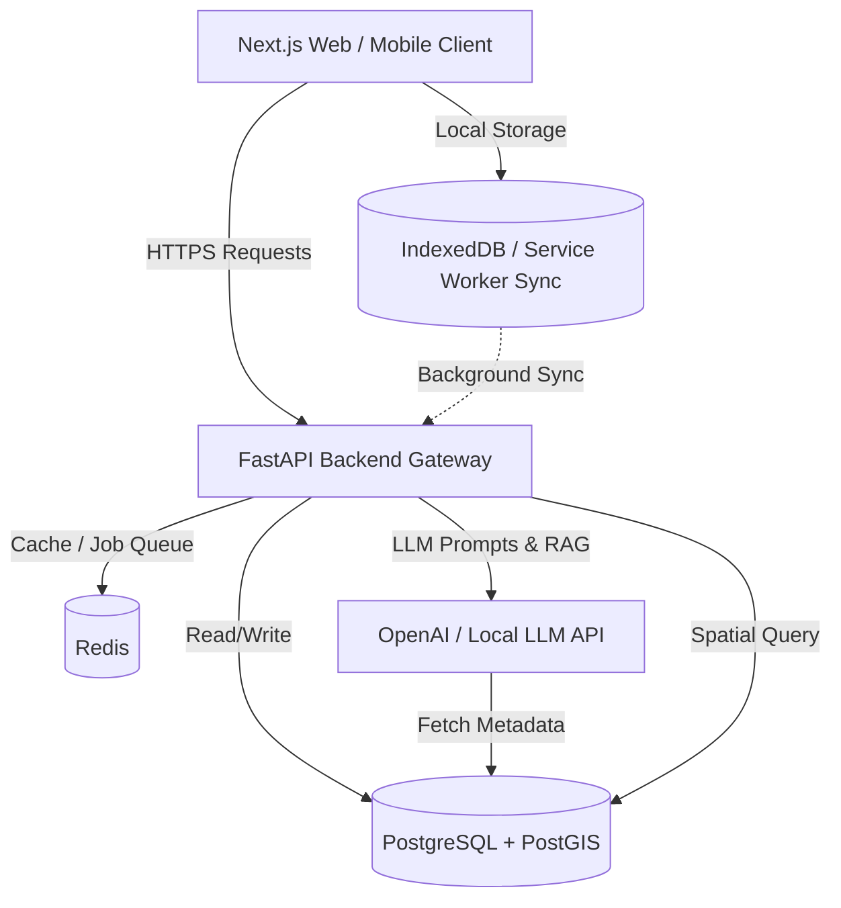

# ROADWATCH 🚧

**ROADWATCH** is an AI-powered road accountability and monitoring platform designed for civic transparency. It enables citizens to lookup road metadata, track contractor performance, monitor municipal budget allocations, report road defects, and interact with an AI routing chatbot. 

Designed for scalability, modern accessibility standards, and low-network resilience in developing regions.

---

## Technical Stack

- **Frontend**: Next.js 15+ (App Router), TypeScript, Tailwind CSS, shadcn/ui, Radix UI primitives, Leaflet / OpenStreetMap for spatial rendering, Workbox for Service Worker / Offline support.
- **Backend**: FastAPI (Python 3.11+), GeoAlchemy2 (spatial extensions for SQLAlchemy), Pydantic v2, Uvicorn, LangChain/LlamaIndex for the AI chatbot.
- **Database**: PostgreSQL 16+ with the PostGIS extension (geospatial storage and queries).
- **Caching & Queueing**: Redis (for local caching, rate limiting, and background tasks).

---

## Directory Structure

ROADWATCH is designed as a modular monorepo. Below is the directory tree layout:

```text
ROADWATCH/
├── README.md                          # Platform overview and setup
├── docker-compose.yml                 # Local dev services (DB, PostGIS, Redis)
├── docs/                              # Architecture, schemas, and specs
│   ├── architecture.md                # System design, routes, API & types
│   ├── schema.sql                     # PostGIS SQL database schema
│   └── mock_data.sql                  # 12 roads, 12 contractors, 20 complaints, 5 authorities
├── backend/                           # FastAPI Backend Application
│   ├── Dockerfile
│   ├── requirements.txt
│   ├── alembic/                       # Database migration configurations
│   └── app/
│       ├── core/                      # Global configurations, security, DB session
│       ├── models/                    # SQLModel/SQLAlchemy DB models (with PostGIS geometry types)
│       ├── schemas/                   # Pydantic schemas (Shared API Types)
│       ├── crud/                      # CRUD db operations
│       ├── api/                       # API routes (v1 router)
│       │   ├── auth.py
│       │   ├── roads.py
│       │   ├── contractors.py
│       │   ├── complaints.py
│       │   └── chat.py
│       ├── services/                  # Business logic (AI routing, GIS calculations)
│       └── main.py                    # Entrypoint
└── frontend/                          # Next.js Frontend Web Client
    ├── package.json
    ├── next.config.js
    ├── tailwind.config.js
    ├── tsconfig.json
    ├── public/
    │   ├── sw.js                      # Custom service worker for offline reporting
    │   └── assets/
    └── src/
        ├── app/                       # App Router (Pages, layouts)
        │   ├── layout.tsx
        │   ├── page.tsx               # Home & Chatbot dashboard
        │   ├── roads/                 # Road lookup & metadata
        │   │   ├── page.tsx
        │   │   └── [id]/page.tsx
        │   ├── contractors/           # Contractor profiles
        │   │   ├── page.tsx
        │   │   └── [id]/page.tsx
        │   └── report/                # Mobile-first complaint form
        │       └── page.tsx
        ├── components/                # Reusable UI components
        │   ├── ui/                    # shadcn components (button, card, dialog, etc.)
        │   ├── map/                   # OSM Leaflet map wrapper
        │   ├── chat/                  # AI Chatbot widget
        │   └── shared/                # Navbar, Footer, OfflineIndicator
        ├── hooks/                     # Custom React hooks (useOfflineSync, useGeolocation)
        ├── lib/                       # Utility functions, API clients, IndexedDB wrapper
        │   ├── db.ts                  # Local IndexedDB for offline queueing
        │   └── api.ts                 # Typed API client
        └── types/                     # Shared TypeScript interfaces
            └── index.ts
```

---

## Architectural Principles

1. **Mobile-First & Accessible UI**: Responsive interface optimized for viewport scales down to 320px width, complying with WCAG 2.1 AA contrast and screen-reader accessibility rules.
2. **Offline-First Reporting**: Reports submitted when offline are stored locally in IndexedDB using a Service Worker Sync Queue. When a connection is restored, the reports are synced using an idempotent background sync process.
3. **Geospatial Intelligence**: PostGIS stores roads as `LINESTRING` and complaints as `POINT`. Spatial indexing (`GIST`) guarantees rapid intersection, buffering, and proximity queries.
4. **AI-Driven Routing**: An LLM-powered chatbot parses natural language citizen queries, queries the PostGIS database via semantic search/structured SQL translation, and automatically classifies and routes complaints to correct municipal authorities based on spatial and category alignment.

---

## System Overview



For detailed specifications, see the [Architecture Document](file:///Users/sanjaywaradkar/ROADWATCH/docs/architecture.md) and [Database Schema](file:///Users/sanjaywaradkar/ROADWATCH/docs/schema.sql).
