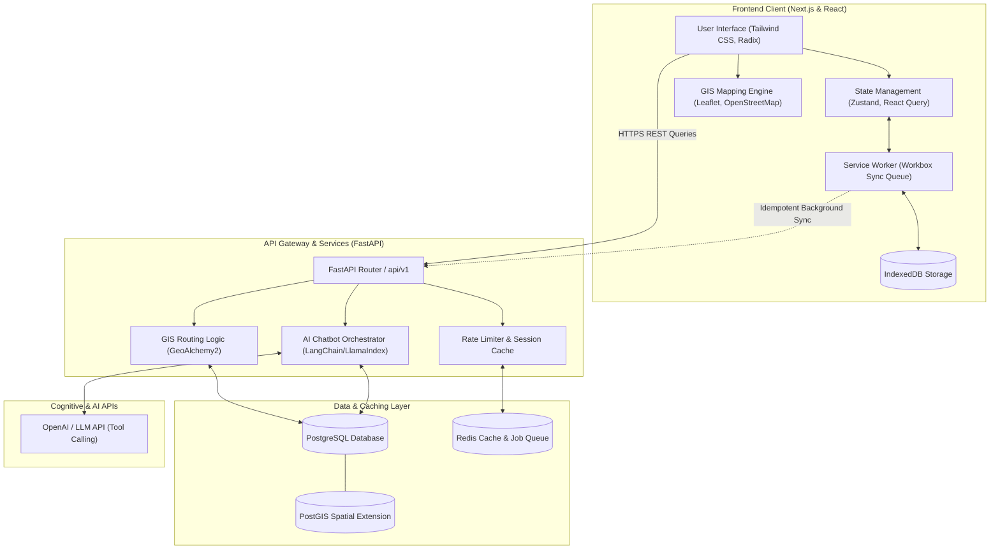

# ROADWATCH 🚧 — Civic Infrastructure Intelligence Platform

**ROADWATCH** is an AI-powered, mobile-first road accountability and monitoring platform designed to bring absolute transparency to public works. The platform enables citizens to inspect road registries using simplified 3D digital twins, monitor municipal budget allocations, track blacklisted contractor scorecards, and report road defects using an offline-resilient, AI-assisted reporting flow.

Designed to feel like a nationally deployable, smart-city public service initiative funded for citizen empowerment and infrastructure audit.

---

## 🏗️ System Component Architecture

The platform operates as a modern monorepo, decoupling a lightweight, PWA-ready Next.js client from a highly performant FastAPI REST gateway backed by a spatial database layer.



---

## 🔄 AI-Assisted Offline reporting & Routing Flow

When a citizen reports road defects in low-connectivity areas, the system leverages a service worker sync queue backed by local IndexedDB. Upon network restoration, the backend coordinates geospatial routing and AI-based classification before updating database records.

```mermaid
sequenceDiagram
    autonumber
    actor Citizen
    participant Client as Next.js Client
    participant IDB as Local IndexedDB
    participant API as FastAPI Backend
    participant DB as PostgreSQL + PostGIS
    participant LLM as OpenAI (GPT-4o)

    Citizen->>Client: Captures image & submits defect report
    alt Is Offline?
        Client->>Client: Compress photo (<500KB) in-browser
        Client->>IDB: Write complaint payload with offline flag & clientTempId
        Client-->>Citizen: Show status "Optimistically Saved (Offline Queue)"
        Note over Client, IDB: Wait until network connection is restored...
        IDB->>Client: Sync triggered by Service Worker
    end
    Client->>API: POST /api/v1/complaints/sync (Batch payload)
    
    rect rgb(20, 30, 45)
        Note over API: Backend Defect Routing Pipeline
        API->>DB: Check spatial intersection using ST_Contains
        DB-->>API: Match authority boundary Polygon (e.g. City Works)
        API->>DB: Find nearest road using ST_DWithin (radius: 20m)
        DB-->>API: Associated road segment details
        API->>LLM: Classify text description (Pothole/Waterlogging/etc)
        LLM-->>API: Confirmed category classification
    end

    API->>DB: Insert official complaint record & route assignment
    API-->>Client: Sync result (200 OK with server_id & assignment status)
    Client->>IDB: Mark synced / Purge image Blob
    Client-->>Citizen: Toast Notification: "Complaint successfully synced & routed to City Works Department!"
```



---

## 🛠️ Technical Stack

- **Frontend**: Next.js 15+ (App Router), React Three Fiber & Drei (WebGL 3D Road Twins), TypeScript, Tailwind CSS, Framer Motion (premium microinteractions and snappable drawers), Leaflet / OpenStreetMap (geospatial layers), Zustand & React Query (state synchronization).
- **Backend**: FastAPI (Python 3.11+), GeoAlchemy2 (spatial extensions for SQLAlchemy), Pydantic v2, Uvicorn, LangChain/LlamaIndex (Conversational LLM integration).
- **Database**: PostgreSQL 16+ with **PostGIS** extension (spatial indexes, geometries, and containment queries).
- **Caching & Queueing**: Redis (IP rate-limiting, conversation state tracking, and background processing).

---

## 📂 Directory Structure

```text
ROADWATCH/
├── README.md                          # Platform overview and setup
├── docker-compose.yml                 # Local dev services (DB, PostGIS, Redis)
├── docs/                              # Architecture, schemas, and specs
│   ├── architecture.md                # System design, routes, API & types
│   ├── schema.sql                     # PostGIS SQL database schema
│   └── mock_data.sql                  # Mock database insertion script
├── backend/                           # FastAPI Backend Application
│   ├── app/
│   │   ├── core/                      # Configs, security, db connection
│   │   ├── models/                    # SQLModel/SQLAlchemy PostGIS database schemas
│   │   ├── api/                       # API routes (roads, contractors, chat, complaints)
│   │   └── services/                  # Business logic (AI routing engine, GIS)
│   └── main.py                        # Backend entrypoint
└── frontend/                          # Next.js Frontend Web Client
    ├── public/
    │   ├── sw.js                      # Service Worker for offline IndexedDB sync queue
    │   └── 3d/                        # WebGL GLB assets
    └── src/
        ├── app/                       # App routes (Dashboard, detail views, reports)
        ├── components/                # Reusable UI parts
        │   ├── 3d/                    # React Three Fiber Road twins & stress overlay
        │   ├── chat/                  # Snappable, draggable AI Chatbot
        │   ├── map/                   # Spatial Leaflet map wrapper
        │   └── shared/                # Responsive Shell & Bottom Drawer layouts
        ├── hooks/                     # Custom hooks (geolocation, offline status)
        ├── lib/                       # Dexie.js IndexedDB client & API handlers
        └── types/                     # Shared TypeScript contracts
```

---

## ⚡ Architectural Principles

1. **Snappable & Draggable Interaction**: The mobile interface features bottom drawers and a floating conversational assistant that can be dragged up to snap to standard view height increments (35% peek, 70% half-screen, 95% full-expanded) using Framer Motion and custom touch-event binding.
2. **Compact Metric Representation**: To prevent text clipping or layout overflow on compact mobile devices, financial metrics are automatically formatted into readable local notations (e.g., **Cr** for Crores, **L** for Lakhs) with responsive font scaling.
3. **Geospatial Isolation**: All spatial queries use standard PostGIS projections (`SRID 4326`) and query bounds. Auto-routing maps coordinate telemetry against authority polygon fences via `ST_Contains` and associates complaints with closest road segments via `ST_DWithin` buffers.
4. **Resilient Hydration**: React components relying on browser-only Web APIs (e.g. `window`, `navigator`) are safely deferred until client-side hydration completes, preventing SSR mismatches and flash-of-unstyled-content (FOUC).

---

## 🚀 Local Development Setup

### Prerequisite Services
Start the local PostGIS and Redis services using Docker Compose from the root folder:
```bash
docker-compose up -d
```

### Backend Installation (FastAPI)
1. Navigate to the backend folder:
   ```bash
   cd backend
   ```
2. Create and source a virtual environment:
   ```bash
   python -m venv venv
   source venv/bin/activate
   ```
3. Install dependencies:
   ```bash
   pip install -r requirements.txt
   ```
4. Run the development server:
   ```bash
   uvicorn app.main:app --reload
   ```

### Frontend Installation (Next.js)
1. Navigate to the frontend folder:
   ```bash
   cd frontend
   ```
2. Install npm packages:
   ```bash
   npm install
   ```
3. Start the Turbopack development server:
   ```bash
   npm run dev
   ```
4. Open [http://localhost:3000](http://localhost:3000) in your browser. Toggle the mobile view in Chrome DevTools (`Cmd + Shift + M`) to experience the mobile-first UX.
