# ROADWATCH 🚧 — Civic Infrastructure Intelligence Platform

**ROADWATCH** is a next-generation smart-city infrastructure accountability and transparency platform. Designed to bridge the gap between citizens, contractors, and municipal departments, the platform enables public spend tracking, automated geospatial defect routing, and real-time infrastructure diagnostics through lightweight WebGL digital twins.

---

## 🏛️ Smart-City Systems Architecture (High-Level Presentation)

This diagram outlines the clean, layered architecture of the ROADWATCH platform, structured for Slide 5 presentations, highlighting key smart-city subsystems, offline-first mechanisms, and geospatial intelligence.

```mermaid
graph TB
    %% Smart-City Systems Architecture
    subgraph Presentation ["1. CITIZEN & EXPERIENCE LAYER"]
        Citizen["Citizen / Field Inspector"]
        PWA["Next.js Responsive Web App (PWA)"]
        Twin["Digital Twin Visualization (R3F)"]
        Citizen --> PWA
        PWA --- Twin
    end

    subgraph Connectivity ["2. RESILIENT OFFLINE SYNC LAYER"]
        SyncMgr["Offline Sync Manager"]
        Compressor["In-Browser Photo Compressor (<500KB)"]
        IDB[(IndexedDB Local Store)]
        SW["Service Worker Background Sync"]
        
        PWA --> SyncMgr
        SyncMgr --> Compressor
        SyncMgr --> IDB
        IDB --- SW
    end

    subgraph Cognitive ["3. AI ACCOUNTABILITY & ROUTING LAYER"]
        Router["Complaint Routing Engine"]
        AIAgent["AI Accountability Agent (LLM + RAG)"]
        Analytics["Transparency & Budget Analytics Engine"]
        
        SW -->|Batch REST Sync| Router
        PWA -->|Citizen Chat Query| AIAgent
        Router --- AIAgent
        AIAgent --- Analytics
    end

    subgraph Intelligence ["4. INFRASTRUCTURE INTELLIGENCE LAYER"]
        GIS["GIS Proximity Service (GeoAlchemy2)"]
        QueryEngine["Structured SQL & Geospatial Translators"]
        
        Router --> GIS
        AIAgent --> QueryEngine
        Analytics --> QueryEngine
    end

    subgraph Storage ["5. GEOSPATIAL & TRANSPARENCY DATABASE"]
        DB[(PostgreSQL Database)]
        GISDb[(PostGIS Extension)]
        Redis[(Redis Cache & Session Store)]
        
        DB --- GISDb
        GIS --> DB
        QueryEngine --> DB
    end

    %% External APIs & Integrations
    subgraph Integrations ["EXTERNAL INTEGRATIONS"]
        OSM["OpenStreetMap API (Leaflet)"]
        LLM["OpenAI GPT-4o (Cognitive APIs)"]
    end

    PWA <--> OSM
    AIAgent <--> LLM

    %% Styling
    classDef layerStyle fill:#0d1117,stroke:#30363d,stroke-width:1px;
    classDef nodeStyle fill:#161b22,stroke:#58a6ff,stroke-width:1.5px,color:#c9d1d9;
    classDef dbStyle fill:#0f2b3e,stroke:#38bdf8,stroke-width:1.5px,color:#e0f2fe;
    classDef extStyle fill:#1c152a,stroke:#c084fc,stroke-width:1.5px,color:#faf5ff;

    class Presentation,Connectivity,Cognitive,Intelligence,Storage layerStyle;
    class Citizen,PWA,Twin,SyncMgr,Compressor,IDB,SW,Router,AIAgent,Analytics,GIS,QueryEngine nodeStyle;
    class DB,GISDb,Redis dbStyle;
    class OSM,LLM extStyle;
```



---

## 🔄 Detailed Execution Pipeline (Technical Appendix)

The sequence diagram below details the technical execution flow, showcasing how the **Resilient Offline Sync Layer** interacts with the **AI Accountability & Routing Engine** to validate, categorize, and assign complaints to municipal departments upon network restoration.

```mermaid
sequenceDiagram
    autonumber
    actor Citizen as Citizen / Inspector
    participant PWA as Next.js Web App
    participant Sync as Offline Sync Manager
    participant DB_Loc as Local IndexedDB
    participant API as FastAPI Backend
    participant Geo as GIS Proximity Service
    participant LLM as AI Accountability Agent
    participant DB as PostGIS DB

    Citizen->>PWA: Captures defect photo & submits report
    alt Connection Offline
        PWA->>Sync: Forward raw complaint payload
        Sync->>Sync: Compress photo (<500KB) in-browser
        Sync->>DB_Loc: Write payload (clientTempId & isOfflinePending=true)
        Sync-->>Citizen: Toast: "Saved to Offline Sync Queue"
        Note over Sync, DB_Loc: Device re-enters network zone
        DB_Loc->>Sync: Trigger Service Worker Background Sync
    end
    
    Sync->>API: POST /api/v1/complaints/sync (Batch payload)
    
    rect rgb(15, 23, 42)
        Note over API: AI Accountability & Routing Engine
        API->>Geo: Invoke Spatial Containment check
        Geo->>DB: Query ST_Contains(geom_boundary, POINT)
        DB-->>Geo: Return matching Authority Boundary Polygon
        Geo->>DB: Query ST_DWithin(road_geom, POINT, radius=20m)
        DB-->>Geo: Return nearest Road Segment metadata
        API->>LLM: Pass text description for classification
        LLM-->>API: Confirm Defect Category (Pothole / Waterlogging / etc.)
    end

    API->>DB: Write official complaint record & route assignment
    API-->>Sync: Sync Result (200 OK with server_id & assignment status)
    Sync->>DB_Loc: Update synced status & purge local image Blob
    Sync-->>Citizen: Toast: "Complaint successfully synced & routed!"
```



---

## 💡 Core Subsystems Breakdown

### 1. AI Accountability Agent
Rather than simple chatbot prompts, the **AI Accountability Agent** implements structured retrieval and reasoning to ensure governance:
- **Structured SQL Translation**: Safely translates citizen queries into database parameter inputs using predefined Python query abstractions to prevent raw injection.
- **Intent Discovery**: Automatically maps queries to contractor portfolios, road budgets, or authority jurisdictions.

### 2. Complaint Routing Engine
- **Spatial Containment (`ST_Contains`)**: Automatically matches defect coordinates against multi-polygon municipal boundaries to route complaints to the responsible department (e.g. City Works, Highway Authority).
- **Proximity Association (`ST_DWithin`)**: Buffers defect points against road lines to identify the exact segment code and responsible paving contractor.

### 3. Resilient Offline Sync Manager
- **Client Compression**: Downscales camera input in-browser to conserve storage and transmission bandwidth in low-reception zones.
- **Background Sync**: Uses a service worker queue backing Dexie.js (IndexedDB) to retry uploads automatically once a network handshake is verified.

### 4. Transparency & Budget Analytics Engine
- **Spend Ratios**: Dynamically computes budget allocation-to-spent ratios to flag contractor overruns or recurring defect clusters.
- **Contractor Scorecard**: Tracks delay percentages and blacklisting flags derived from real-time database views.

---

## 🛠️ Technical Stack

- **Frontend**: Next.js 15+ (App Router), React Three Fiber & Drei (WebGL 3D Road Twins), TypeScript, Tailwind CSS, Framer Motion (premium microinteractions and snappable drawers), Leaflet / OpenStreetMap (geospatial layers), Zustand & React Query (state synchronization).
- **Backend**: FastAPI (Python 3.11+), GeoAlchemy2 (spatial extensions for SQLAlchemy), Pydantic v2, Uvicorn, LangChain/LlamaIndex (Conversational LLM integration).
- **Database**: PostgreSQL 16+ with **PostGIS** extension (spatial indexes, geometries, and containment queries).
- **Caching & Queueing**: Redis (IP rate-limiting, conversation state tracking, and background processing).

---

## 📂 Directory Structure

```text
ROADWATCH/
├── README.md                          # Platform overview and setup
├── docker-compose.yml                 # Local dev services (DB, PostGIS, Redis)
├── docs/                              # Architecture, schemas, and specs
│   ├── architecture.md                # System design, routes, API & types
│   ├── schema.sql                     # PostGIS SQL database schema
│   └── mock_data.sql                  # Mock database insertion script
├── backend/                           # FastAPI Backend Application
│   ├── app/
│   │   ├── core/                      # Configs, security, db connection
│   │   ├── models/                    # SQLModel/SQLAlchemy PostGIS database schemas
│   │   ├── api/                       # API routes (roads, contractors, chat, complaints)
│   │   └── services/                  # Business logic (AI routing engine, GIS)
│   └── main.py                        # Backend entrypoint
└── frontend/                          # Next.js Frontend Web Client
    ├── public/
    │   ├── sw.js                      # Service Worker for offline IndexedDB sync queue
    │   └── 3d/                        # WebGL GLB assets
    └── src/
        ├── app/                       # App routes (Dashboard, detail views, reports)
        ├── components/                # Reusable UI parts
        │   ├── 3d/                    # React Three Fiber Road twins & stress overlay
        │   ├── chat/                  # Snappable, draggable AI Chatbot
        │   ├── map/                   # Spatial Leaflet map wrapper
        │   └── shared/                # Responsive Shell & Bottom Drawer layouts
        ├── hooks/                     # Custom hooks (offline status, geolocation)
        ├── lib/                       # Dexie.js IndexedDB client & API handlers
        └── types/                     # Shared TypeScript contracts
```

---

## 🚀 Local Development Setup

### Prerequisite Services
Start the local PostGIS and Redis services using Docker Compose from the root folder:
```bash
docker-compose up -d
```

### Backend Installation (FastAPI)
1. Navigate to the backend folder:
   ```bash
   cd backend
   ```
2. Create and source a virtual environment:
   ```bash
   python -m venv venv
   source venv/bin/activate
   ```
3. Install dependencies:
   ```bash
   pip install -r requirements.txt
   ```
4. Run the development server:
   ```bash
   uvicorn app.main:app --reload
   ```

### Frontend Installation (Next.js)
1. Navigate to the frontend folder:
   ```bash
   cd frontend
   ```
2. Install npm packages:
   ```bash
   npm install
   ```
3. Start the Turbopack development server:
   ```bash
   npm run dev
   ```
4. Open [http://localhost:3000](http://localhost:3000) in your browser. Toggle the mobile view in Chrome DevTools (`Cmd + Shift + M`) to experience the mobile-first UX.
