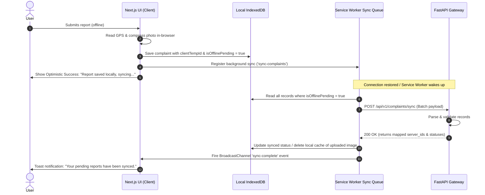

# ROADWATCH Architectural Specifications

This document details the software architecture, system interfaces, URL routing, API endpoints, data models, and vertical slices for **ROADWATCH**.

---

## 1. URL Routes

### 1.1. Frontend Web Client (Next.js App Router)

All frontend routes are optimized for mobile-first rendering (320px+) and meet WCAG 2.1 AA accessibility guidelines (semantic markup, ARIA roles, focus management).

| Route | View Description | Primary Layout/Features |
| :--- | :--- | :--- |
| `/` | Landing page & Interactive AI Dashboard | Search bar, overall statistics (complaints resolved, budget active), overlay for the AI Chatbot widget. |
| `/roads` | Road Directory & Map View | Split-screen Leaflet.js map and filterable list of roads. Spatial bounding box search. |
| `/roads/[id]` | Road Metadata & Timeline | Geospatial highlighting of road path, total budget allocated vs. spent, contractor assignment, and associated complaints timeline. |
| `/contractors` | Contractor Directory | List of contractors with search, aggregate ratings, and filter by status (active/blacklisted). |
| `/contractors/[id]`| Contractor Transparency Scorecard | Profile, completion rate, average project delay, visual rating metrics, list of current and past projects. |
| `/report` | Mobile-First Report Page | GPS-based automated complaint form with photo input. Operates fully offline using local storage. |
| `/admin` | Administration & Escalations | Municipal routing queue, manually override auto-assigned complaints, and bulk export functions. |

---

### 1.2. Backend REST API Routing (FastAPI v1)

All backend endpoints are prefixed with `/api/v1`.

| Method | Endpoint | Description | Auth Required |
| :--- | :--- | :--- | :--- |
| `POST` | `/auth/login` | Citizen or administrative login (JWT based) | No |
| `GET` | `/roads` | Query road segments (supports bounding box `bbox`, `status`, `name`) | No |
| `GET` | `/roads/{id}` | Retrieve individual road metadata + PostGIS GeoJSON geometry | No |
| `GET` | `/contractors` | Query contractors (filters: `rating_min`, `search_query`) | No |
| `GET` | `/contractors/{id}`| Detail profile of contractor + completed projects metrics | No |
| `GET` | `/complaints` | Query complaints (spatial radial search, status filters) | No |
| `POST` | `/complaints` | Create a single complaint (supports multipart file upload) | Optional |
| `POST` | `/complaints/sync` | Batch import offline-queued complaints (JSON payload) | Optional |
| `POST` | `/chat` | Process conversational chat query (returns response + citations) | No |
| `GET` | `/authorities` | List municipal & state authorities and coverage statistics | No |
| `POST` | `/integrations/sms` | SMS/USSD endpoint — accepts `ROAD <query>` via POST, returns plain-text summary | No |
| `POST` | `/integrations/whatsapp/webhook` | WhatsApp/Twilio incoming webhook for media + GPS complaint routing | No |

---

## 2. API Contracts (Input/Output Schemas)

### 2.1. Road Lookup
#### `GET /api/v1/roads`
* **Query Parameters:**
  * `bbox` (string, optional): Format `min_lon,min_lat,max_lon,max_lat` (e.g., `72.80,18.90,72.95,19.10`)
  * `authority_id` (integer, optional): Filter by maintaining department
  * `status` (string, optional): `good`, `fair`, `poor`, `under_construction`
* **Response `200 OK`:**
  ```json
  {
    "count": 12,
    "roads": [
      {
        "id": 1,
        "name": "Link Road",
        "authority_id": 2,
        "status": "under_construction",
        "length_km": 4.2,
        "total_budget": 12500000.00,
        "spent_budget": 8500000.00,
        "geometry": {
          "type": "LineString",
          "coordinates": [
            [72.8354, 19.1196],
            [72.8362, 19.1304],
            [72.8378, 19.1415]
          ]
        }
      }
    ]
  }
  ```

---

### 2.2. Contractor Profile
#### `GET /api/v1/contractors/{id}`
* **Response `200 OK`:**
  ```json
  {
    "id": 5,
    "name": "Apex Infrastructure Ltd",
    "license_number": "LIC-2019-9941",
    "rating": 3.8,
    "projects_completed": 14,
    "projects_delayed": 3,
    "active_projects_count": 2,
    "blacklisted": false,
    "total_contract_value": 450000000.00,
    "recent_projects": [
      {
        "project_id": 102,
        "road_name": "S.V. Road",
        "budget": 24000000.00,
        "status": "in_progress",
        "start_date": "2025-01-10",
        "target_end_date": "2026-06-30"
      }
    ]
  }
  ```

---

### 2.3. Complaint Reporting (Offline-first & Standard)
#### `POST /api/v1/complaints` (Multipart form-data)
* **Request Form Fields:**
  * `title` (string, required): Title of complaint (e.g. "Deep Pothole at intersection")
  * `description` (string, required): Detailed description
  * `category` (string, required): `pothole`, `paving_defect`, `waterlogging`, `debris`, `missing_signage`
  * `latitude` (float, required): GPS Latitude
  * `longitude` (float, required): GPS Longitude
  * `image` (binary file, optional): Photographic evidence
  * `offline_created_at` (string, optional): Timestamp when submitted offline (ISO 8601)
  * `client_temp_id` (uuid, optional): UUID generated locally for sync tracking
* **Response `201 Created`:**
  ```json
  {
    "id": 124,
    "client_temp_id": "8f8b8c1a-289e-4b47-b8db-c8db05ab1c1b",
    "status": "pending",
    "assigned_authority_id": 3,
    "created_at": "2026-05-23T02:24:17Z",
    "message": "Complaint successfully logged and routed to City Works Department."
  }
  ```

#### `POST /api/v1/complaints/sync` (JSON Batch upload)
* **Request Body:**
  ```json
  {
    "queue": [
      {
        "client_temp_id": "8f8b8c1a-289e-4b47-b8db-c8db05ab1c1b",
        "title": "Severe Waterlogging near station",
        "description": "Flooding up to 1 foot during light rain.",
        "category": "waterlogging",
        "latitude": 19.1235,
        "longitude": 72.8241,
        "offline_created_at": "2026-05-22T18:30:00Z"
      }
    ]
  }
  ```
* **Response `200 OK`:**
  ```json
  {
    "synced_count": 1,
    "errors": [],
    "results": [
      {
        "client_temp_id": "8f8b8c1a-289e-4b47-b8db-c8db05ab1c1b",
        "server_id": 125,
        "status": "routed",
        "assigned_authority_id": 1
      }
    ]
  }
  ```

---

### 2.4. AI Chatbot Interface
#### `POST /api/v1/chat`
* **Request Body:**
  ```json
  {
    "message": "Who is the contractor for the Western Express Highway pothole repairs?",
    "session_id": "sess_987654",
    "latitude": 19.1500,
    "longitude": 72.8500
  }
  ```
* **Response `200 OK`:**
  ```json
  {
    "message": "The contractor responsible for the repairs on the Western Express Highway is **Apex Infrastructure Ltd**. This project has a budget of ₹12,500,000 and is supervised by the State Highway Department. Would you like me to show their current rating or file a complaint?",
    "intent": "contractor_lookup",
    "entities": {
      "contractor": "Apex Infrastructure Ltd",
      "road": "Western Express Highway",
      "authority": "State Highway Department"
    },
    "suggested_actions": [
      {
        "type": "navigate_to_contractor",
        "target_id": 5,
        "label": "View Apex Infrastructure Profile"
      },
      {
        "type": "report_complaint_on_road",
        "target_id": 12,
        "label": "File Complaint on this Highway"
      }
    ]
  }
  ```

---

### 2.5. SMS/USSD Interface

#### `POST /api/v1/integrations/sms`
* **Purpose:** Accept plain-text SMS messages forwarded by a telecom carrier. Designed for USSD/SMS gateway integration. For the hackathon, accepts direct POST requests.
* **Request Body:**
  ```json
  {
    "from": "+919876543210",
    "text": "ROAD Western Express Highway"
  }
  ```
* **Response `200 OK`:**
  ```json
  {
    "response": "Western Express Highway (NH-48, 7.2km): ⚠️ FAIR. Last repair: Mar 2026 by Zenith Construction. 12 complaints this year."
  }
  ```
* **Behavior:**
  - Text must start with `ROAD ` (case-insensitive) followed by a road name query.
  - Returns a concise summary limited to SMS segment length (~160 chars).
  - If multiple roads match, lists them and asks for disambiguation.
  - If no match, returns a help message with example queries.

---

## 3. Shared Types

To maintain end-to-end type safety, models are defined in FastAPI (using Pydantic) and Next.js (using TypeScript).

### 3.1. Pydantic Models (Backend - `backend/app/schemas/`)

```python
# file: backend/app/schemas/shared.py
from pydantic import BaseModel, Field
from typing import List, Optional, Tuple, Dict, Any
from datetime import datetime
from uuid import UUID

# PostGIS GeoJSON helper schema
class GeoJSONLineString(BaseModel):
    type: str = "LineString"
    coordinates: List[Tuple[float, float]]  # [[longitude, latitude], ...]

class GeoJSONPoint(BaseModel):
    type: str = "Point"
    coordinates: Tuple[float, float]  # [longitude, latitude]

class RoadBase(BaseModel):
    name: str
    authority_id: int
    status: str
    length_km: float
    total_budget: float
    spent_budget: float

class RoadResponse(RoadBase):
    id: int
    geometry: GeoJSONLineString

    class Config:
        from_attributes = True

class ComplaintCreate(BaseModel):
    title: str = Field(..., min_length=5, max_length=100)
    description: str = Field(..., min_length=10)
    category: str
    latitude: float = Field(..., ge=-90.0, le=90.0)
    longitude: float = Field(..., ge=-180.0, le=180.0)
    offline_created_at: Optional[datetime] = None
    client_temp_id: Optional[UUID] = None

class ComplaintResponse(BaseModel):
    id: int
    client_temp_id: Optional[UUID]
    title: str
    description: str
    category: str
    latitude: float
    longitude: float
    status: str
    assigned_authority_id: Optional[int]
    created_at: datetime
    image_url: Optional[str]
```

### 3.2. TypeScript Definitions (Frontend - `frontend/src/types/index.ts`)

```typescript
// file: frontend/src/types/index.ts

export type RoadStatus = 'good' | 'fair' | 'poor' | 'under_construction';
export type ComplaintCategory = 'pothole' | 'paving_defect' | 'waterlogging' | 'debris' | 'missing_signage';
export type ComplaintStatus = 'pending' | 'routed' | 'in_progress' | 'resolved' | 'rejected';

export interface GeoJSONLineString {
  type: 'LineString';
  coordinates: [number, number][]; // [longitude, latitude][]
}

export interface GeoJSONPoint {
  type: 'Point';
  coordinates: [number, number]; // [longitude, latitude]
}

export interface Road {
  id: number;
  name: string;
  authorityId: number;
  status: RoadStatus;
  lengthKm: number;
  totalBudget: number;
  spentBudget: number;
  geometry: GeoJSONLineString;
}

export interface Contractor {
  id: number;
  name: string;
  licenseNumber: string;
  rating: number;
  projectsCompleted: number;
  projectsDelayed: number;
  activeProjectsCount: number;
  blacklisted: boolean;
  totalContractValue: number;
}

export interface Complaint {
  id?: number; // Optional for offline-created local records
  clientTempId?: string; // UUID used for local-to-remote reconciliation
  title: string;
  description: string;
  category: ComplaintCategory;
  latitude: number;
  longitude: number;
  status: ComplaintStatus;
  assignedAuthorityId?: number;
  createdAt?: string; // ISO 8601 string
  imageUrl?: string;
  isOfflinePending?: boolean; // UI flag for client-side local storage status
}
```

---

## 4. Low-Network Resilience Architecture

Because ROADWATCH is deployed in settings with unreliable mobile connections, its architecture prioritizes offline durability and data persistence.



### 4.1. Local Storage Schema (IndexedDB via Dexie.js)
```javascript
// Database initialized in: frontend/src/lib/db.ts
import Dexie, { type Table } from 'dexie';

export class RoadwatchLocalDB extends Dexie {
  complaints!: Table<{
    clientTempId: string;
    title: string;
    description: string;
    category: string;
    latitude: number;
    longitude: number;
    offlineCreatedAt: string;
    imageBlob: Blob | null; // Stores raw compressed image in IndexedDB binary storage
    isOfflinePending: boolean;
  }>;

  constructor() {
    super('RoadwatchLocalDB');
    this.version(1).stores({
      complaints: 'clientTempId, isOfflinePending, offlineCreatedAt'
    });
  }
}
export const localDb = new RoadwatchLocalDB();
```

---

## 5. Vertical Slices

To illustrate how features map across the stack, the two core vertical slices are detailed below.

### 5.1. Slice A: Road Search and Geospatial Mapping
1. **Frontend View Selection**: The user opens `/roads` on their phone.
2. **Geolocation Fetching**: Next.js uses `navigator.geolocation` to center the Leaflet Map.
3. **Map Bounding Box Query**: As the map moves, the component triggers a search:
   `GET /api/v1/roads?bbox=72.82,19.10,72.88,19.15`
4. **Database Query (PostGIS)**: FastAPI parses the bounding box. It utilizes SQLAlchemy/GeoAlchemy2 to run a spatial query against the `roads` spatial table:
   ```sql
   SELECT id, name, status, total_budget, spent_budget, ST_AsGeoJSON(geom) 
   FROM roads 
   WHERE geom && ST_MakeEnvelope(72.82, 19.10, 72.88, 19.15, 4326);
   ```
5. **Serialization**: FastAPI formats geometries as standard GeoJSON LineStrings and serializes budgets to decimal formats, sending it back to the client.
6. **Map Rendering**: Next.js parses the GeoJSON array and renders colored paths directly on the OpenStreetMap layer (Green for Good, Orange for Fair, Red for Poor, Blue for Under Construction). Clicking a segment triggers a router push to `/roads/[id]`.

### 5.2. Slice B: Offline Complaint Routing & AI Categorization
1. **Offline submission**: A citizen encounters a pothole on a village road with zero network signal. They visit `/report`, fill details, take a photo, and click submit.
2. **Local Persistence**: The application compresses the image to a low-res JPG, saves it to IndexedDB, and registers a Background Sync event.
3. **Background Sync Trigger**: Once the citizen enters a network zone, the browser activates the Service Worker's sync event.
4. **Batch Sync Pipeline**: The worker uploads the batch of complaints to `/api/v1/complaints/sync`.
5. **AI Classification and Routing**: For each complaint, FastAPI executes a pipeline:
   - Queries PostGIS to check which `authority` boundary (`POLYGON`) the coordinates fall inside:
     ```sql
     SELECT id, name FROM authorities WHERE ST_Contains(geom_boundary, ST_SetSRID(ST_Point(longitude, latitude), 4326));
     ```
   - Triggers an LLM prompt containing the complaint text and matching categories to confirm category type (e.g. mapping "huge crack that water is filling" -> "waterlogging" vs "paving_defect").
   - Allocates the `assigned_authority_id`.
6. **DB Insert**: Saves the record to PostgreSQL.
7. **Reconciliation**: The client-side database marks the complaint as synced, removes the image Blob from IndexedDB to conserve storage, and updates the UI status.

---

## 6. Resolved Design Decisions & Architecture Controls

During architectural alignment, the following design decisions were established:

### 6.1. Chatbot Retrieval Integration
- **Mechanism**: The LLM-powered chatbot utilizes **Tool Calling / Function Calling** (via APIs like OpenAI or Anthropic) to interface with a custom, secure PostgreSQL/PostGIS database query layer.
- **Security**: The LLM is restricted from directly executing arbitrary raw SQL generated on the fly. Rather, it triggers predefined, parameterized Python functions (e.g. `query_road_status_by_name`, `get_contractor_ratings`, or `find_nearest_potholes`) to retrieve data safely.

### 6.2. Authentication & Spam Control
- **Citizens**: To minimize reporting friction and maximize civic engagement, citizens can submit complaints **anonymously** (or with optional, lightweight contact details like email/phone number).
- **Administrators & Contractors**: Full JWT-based authentication is required to access administrative queues, override auto-routed issues, or upload budgets.

### 6.3. Offline Photo Compression & Synchronization
- **Client Compression**: Before storing images offline, the Next.js client uses canvas resizing/compression to downscale images to under **500KB**.
- **IndexedDB Storage**: The compressed image is saved as a binary Blob in the local IndexedDB.
- **Sync Behavior**: The Service Worker utilizes standard `multipart/form-data` uploads during connection restoration to sync photos to FastAPI, immediately deleting local image Blobs to avoid storage capacity exhaustion.

### 6.4. Geospatial Routing Logic
- **Authority Bounds**: Auto-routing complaints to authorities is executed using PostGIS `ST_Contains` spatial intersection against the authorities' boundary polygon (`geom_boundary`).
- **Road Association**: Complaints are associated with the closest road segment by querying roads within a radial boundary of **20 meters** using `ST_DWithin`.

### 6.5. Frontend State Management
- **API Fetching**: TanStack Query (React Query) handles standard server state caching, queries, and optimistic mutations.
- **Client State**: Zustand manages client-side UI states, including active filters, open panels, map boundaries, and temporary chatbot dialog states.

### 6.6. Contractor Scorecard Metrics
- **Dynamic Aggregation**: Metrics such as completion rates, average project delay days, and total contract value are computed on-demand via database views or aggregate queries over the `projects` table.
- **Blacklisting**: The blacklist status itself is kept as a simple boolean field on the `contractors` table, toggled manually via administrative override.

### 6.7. Security and LLM Cost Controls
- **Input Classifier**: An upfront, lightweight classifier (or system guardrail) checks incoming queries to the `/chat` API for domain relevance (e.g., matching keywords or intent related to roads, budgets, contractors, or complaints).
- **IP Rate Limiting**: Redis enforces a strict sliding-window rate limit (defaulting to 5 requests per minute per IP) to prevent bot abuse and cost spikes.

